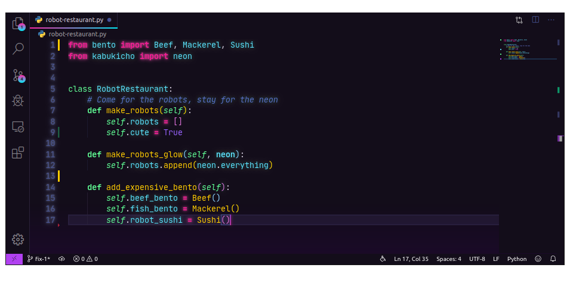

# Kabukichō Theme for Visual Studio Code


A techno-neon, autorobotic, VHS-degradaded, superatomic-AI color theme for Visual Studio Code. Of course those are real words. Whatever, man. You can't stop the signal.

  
Font in the screenshot is [JetBrains Mono](https://www.jetbrains.com/lp/mono/).

## Installation

Open VS Code, then launch Quick Open (`Ctrl+P`). Paste in `ext install victoriadrake.kabukicho` and press enter.

Alternatively, clone this repository into your VS Code extensions folder ([where is that?](https://code.visualstudio.com/docs/editor/extension-gallery#_where-are-extensions-installed)), then restart VS Code. 

To activate the wave, use the keyboard shortcut `Ctrl+K Ctrl+T` or select **File** > **Preferences** > **Color Theme** and choose **Kabukichō**.

Optionally, activate the custom CSS for a Robot-Restaurant-style party session:

1. Install the [Custom CSS and JS Loader](https://marketplace.visualstudio.com/items?itemName=be5invis.vscode-custom-css) extension.

2. Tell Custom CSS and JS Loader to use the CSS file included with this theme by adding an import line to your VS Code `settings.json` file:

```json
{
  "vscode_custom_css.imports": [
    "file://FULL/PATH/lights-on.css"
    ]
}
```

Be sure to use the correct full file path URL to the CSS file for your operating system. This may be in your VS Code extensions directory, or wherever you choose to store the file it in your filesystem.

Windows example: `file:///C:/Users/username/.vscode/extensions/name-of-extension/lights-on.css`

MacOS and Linux example: `file:///home/user/.vscode/extensions/name-of-extension/lights-on.css`

For troubleshooting, see [full set up instructions for Custom CSS and JS here](https://github.com/be5invis/vscode-custom-css#getting-started).

3. From the command palette (`Ctrl + Shift + P` or `Shift + ⌘ + P`), select **Reload Custom CSS and JS**. You can also **Disable** and **Enable** the custom CSS from here.

Though it's very `A` `E` `S` `T` `H` `E` `T` `I` `C`, the fun glow effect can strain your eyes and isn't meant for long coding sessions. Also, the custom CSS injector has its downsides. Be sure you [read and understand](https://github.com/be5invis/vscode-custom-css/blob/master/README.md) what's involved.

## Origins and Thanks

This theme began as a let's-be-reasonable-now fork of @webrender's [synthwave-x-fluoromachine](https://github.com/webrender/synthwave-x-fluoromachine) theme, which was forked from @robbowen's [Synthwave '84 theme](https://marketplace.visualstudio.com/items?itemName=RobbOwen.synthwave-vscode) and merged with @fullerenedream's [Fluoromachine](https://colorsublime.github.io/themes/FluoroMachine/) Sublime Text theme.

The `tokenColors` definitions are heavily borrowed from [Noctis](https://github.com/liviuschera/noctis), with which @liviuschera is doing excellent work.

The very nostalgic glow stylesheet originates with @robbowen.

Most of the `demos/` are from [Night Owl](https://github.com/sdras/night-owl-vscode-theme) and the clever how-to article by @sdras, [Creating a VS Code Theme](https://css-tricks.com/creating-a-vs-code-theme/).
